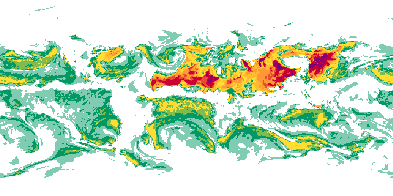
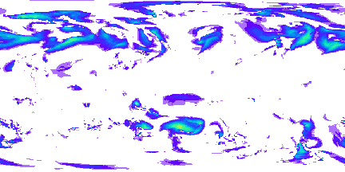

# jsmap stream loader

The jsmap format is compressed binary format designed for efficient 
streaming of paletted images over HTTP2.

For the live demo, check https://aqicn.github.io/jsmap/ or https://aqicn.org/forecast/models/

# Usage Example

	

	

# API

The library expose a single method `load`, which returns a promise.

The promise is fullfilled once the map model is loaded.

The promise contains a subscriber `frames` (similar to Rx) from which the application can receive the frames being loaded.

	load: ( options: Options ) => Promise<Stream>;

	interface Options {
		model?: string;
		fps?: number;
	}

	interface Frame
	{
		idx: number	 		/* frame number, from 0 to n-1 */
		matrix: Uint8Array; /* frame data */
		datetime: Date 		/* frame time */
	}

	interface Subscriber<T> {
		subscribe: ( cb:(frame: T)=>void ) => void;
	}

	interface Stream {
		nframes: number,	/* Total number of frames */
		bounds: {			/* Frames bounds in lat,lng */
			topLeft: {
				lat: number,
				lng: number
			},
			bottomRight: {
				lat: number,
				lng: number
			}
		}
		size: {				/* Frames size in pixels */
			width: number,
			height: number,
		}
		timespan: {			/* Time span of all frames */
			min:Date,
			max:Date
		},
		lut: {				/* Lookup table for the frame data */
			colors: Array<string>,	/* HTML colors */
			vcolors: Array<number>	/* Hex colors */
			aqi: Array<number>
		},
		frames: Subscriber<Frame>,	/* Frames stream */
	}

# Testing

The jasmine test are provided in the `test` folder.

You can use `npm test` to run them.

# Example

The example code for the browser is located in `example/browser`.

For Node, check the gif encoder example in `example/node`.

You can also check https://aqicn.github.io/jsmap/ for a live demo.

